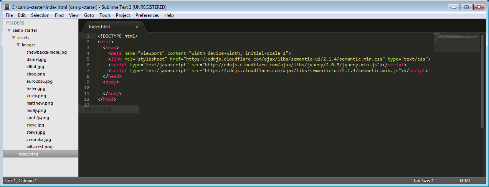
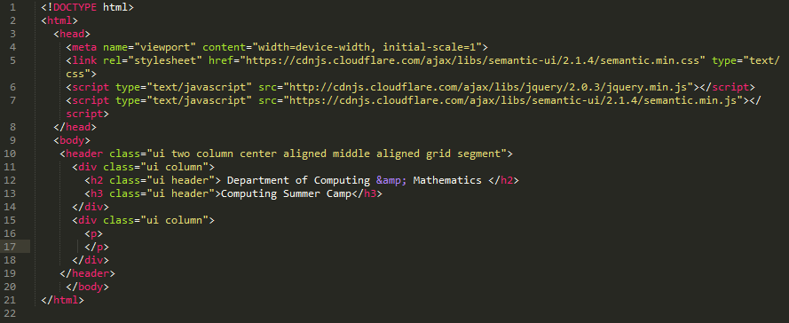
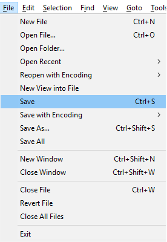
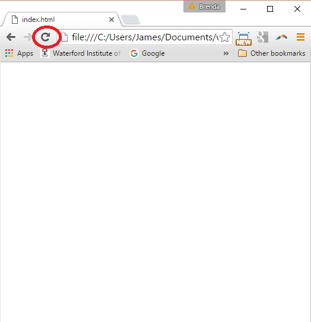
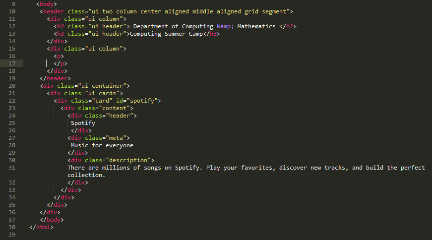
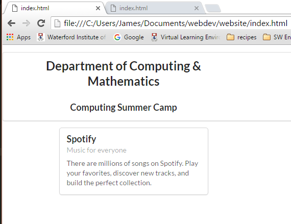

#Web Development Tools

The following screens are open on your computer:

Sublime Text Editor, this is where you will write your code for creating the website.

Chrome Web Browser, this is the application you use to view you website locally on your computer and remotely on the Internet.

Windows Command Prompt, this is where you will write instructions to publish your website to the Internet.

##Structure

To develop a web page you must have a html code that the web browser understands and presents as a web page.

The code you see in your Sublime editor is html code. It contains two parts, the `<head`> shown as the green section, and the `<body`> shown as the red section.

You will not be making changes to the `<head`> section, all of your code will be put into the `<body`> which at the moment is blank. While it is blank the webpage open in the browser is also empty of any content and displays just as a white page. 

- Copy the following lines of code (highlight the code, right click and choose copy) 

~~~

    <header class="ui two column center aligned middle aligned grid segment">
      

        <h2 class="ui header"> Department of Computing &amp; Mathematics </h2>
        <h3 class="ui header">Computing Summer Camp</h3>
      

      

        

        

      

    </header>
~~~     

- Go to the Sublime text editor and paste the code so that it appears in between the `<body`> and the `</body`>
- It should look like this:

- From the File menu choose Save.

- Go to the Chrome web browser that is open on your computer and click the refresh button (see it circled in red below).

- You should see the following appear in your web page:

- You have now edited your html code so that the text will show in the browser. Next we will add more content.

- Copy the following code 

~~~

 

      

        

          

            

             Spotify
            

            

             Music for everyone
            

            

            There are millions of songs on Spotify. Play your favorites, discover new tracks, and build the perfect collection.
            

          

        

      

~~~

- Go back to the Sublime text editor and paste it into the html code so that it comes directly after the `</header`> as you can see below:

- Once you are happy that your code looks the same as the image above then choose Save from the File menu.
- Go to the Chrome web browser and click the refresh button to be able to view the changes you made.

Your web page should now look like this.

- Scroll back up to the top of this page and click on step 02 in this lab (link is in the top bar of this web page).