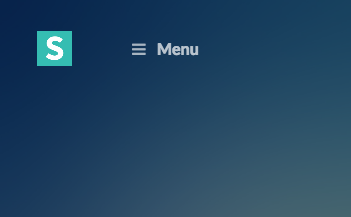
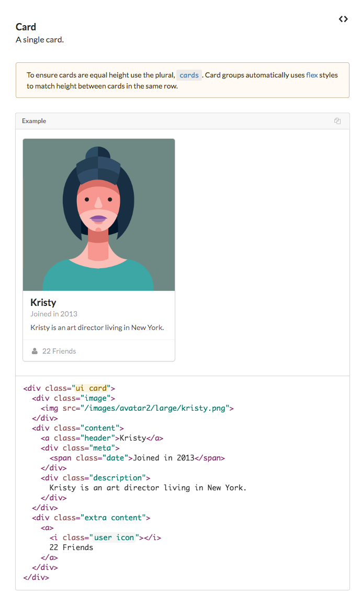
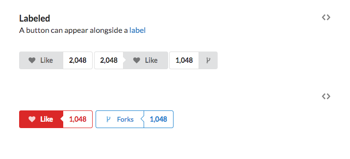
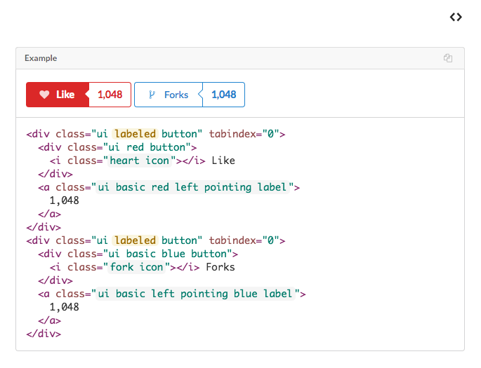

#Toolkit

You have been building a page using this toolkit here:

- <http://semantic-ui.com/>

This is a library of web components - and you can pick and choose from many different types of component (scroll down to see some examples). If you click on the `menu` button on the top left:

Then it will reveal a palette of interesting components:

You have been using the `card` - at the very end of the list above. Click on `card` in the list, and you will see a basic card:

Here is the interesting part - click on the `<>` symbols on the top right - and the codes needed to display a card are revealed:

If you copy and paste the revealed code:

~~~

  

    
  

  

    <a class="header">Kristy</a>
    

      Joined in 2013
    

    

      Kristy is an art director living in New York.
    

  

  

    <a>
      <i class="user icon"></i>
      22 Friends
    </a>
  

~~~

..into your page you get the card:

  

    
  

  

    <a class="header">Kristy</a>
    

      Joined in 2013
    

    

      Kristy is an art director living in New York.
    

  

  

    <a>
      <i class="user icon"></i>
      22 Friends
    </a>
  

(The image will not work initaly - but dont worry about this).

Hunt around among the other components and see what you can make work. Remember, you need to press the `<>` link to get the code, then past the code into your page, save the file, and refresh the page to see it in action. For example, have a look at:

- [Buttons](http://semantic-ui.com/elements/button.html)
- [Labels](http://semantic-ui.com/elements/label.html)
- [Lists](http://semantic-ui.com/elements/list.html)
- [Comments](http://semantic-ui.com/views/comment.html)
- [Statistic](http://semantic-ui.com/views/statistic.html)
- [Progress](http://semantic-ui.com/modules/progress.html)

See of you can make some of these, or any others ones, work.

##Example - Button

For instance if you visit this page:

- <http://semantic-ui.com/elements/button.html>

Scroll down a bit and you see some interesting buttons:

Press `<>` to reveal the code:

Copy/paste the first button into your page - perhaps inside a card - you can get this effect:

  

    
  

  

    <a class="header">Kristy</a>
    

      Joined in 2013
    

    

      Kristy is an art director living in New York.
    

  

  

  

    <i class="heart icon"></i> Like
  

  <a class="ui basic red left pointing label">
    1,048
  </a>

  

Go and explore some more components!

