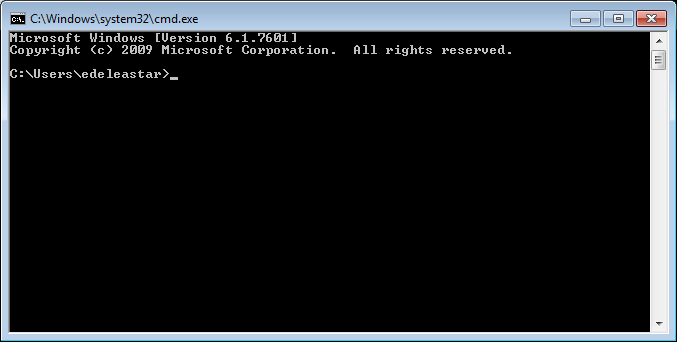
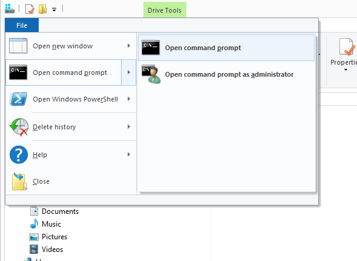
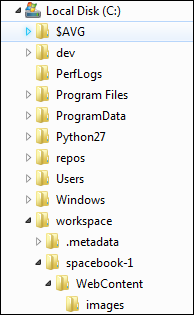
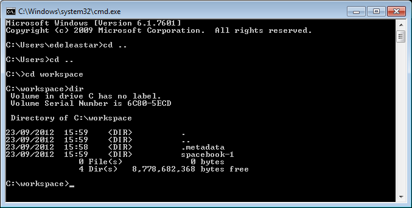
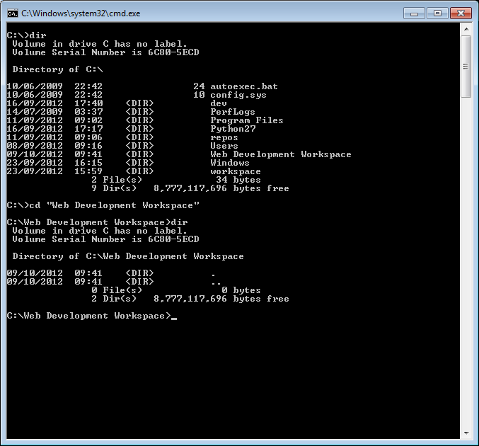

# The Command Prompt

In order to publish the site - we will need to become familiar with the Windows Command prompt - a application on your windows PC.

## Command Prompt

Open a command prompt on Windows. The easiest way to do this is in Windows 7 to type 'cmd' in the Search Box on the Windows start menu:

When you type it, the start menu might change to the following:

...and if you press return, then the command window itself will appear:

On Windows 8 and 10, access the desktop from the home screen, and run File Explorer (may be in the toolbar). Then select File->Open Command Prompt:

## Command Line

This is an alternative interface to Windows which it is important to become familiar with. In this window you can type what are sometimes called 'DOS' commands. These commands let you have a finer level of control of your PC, and are particularly important for programmers to master.

Here are some simple commands:

- dir
    - list all files in a directory
- cd ..
    - change to a parent directory
- cd \<directory name>
    - change to a specific directory

It is essential that you become adept at these commands, and a few others.

Bear in mind that these commands always have a 'current directory' in mind (a directory is another name for a folder). Try them now and see if you can 'navigate' to your web development workspace. For instance, if the folder is located as shown here:

Then the commands to get there will look like this:

If your workspace is located on another drive, the enter that drive letter first - say "G:", press return, and then try the cd and dir commands.

Note in all of the above that the 'prompt' in the command window is always showing the 'current' drive/directory.

Also, if you have a 'space' in your directory (a bad idea generally), then you will have to use quotation marks in the commands. Here is an example:

See in the above transcript that the directory name is "Web Development Workspace" - and it has been enclosed in double quotes.

In general, however, it is best to adopt the following conventions.

- Never use spaces in directory or file names

- Never use upper case in directory or file names

- If you wish to use readable multiple words for a directory or file name, separate the words with '-'. e.g.
    - web-development
    - java-projects

Perhaps you might take this opportunity to adjust your workspace and projects to adopt the above conventions. If you do, then you will find that using DOS commands to navigate your folders will be considerably easier.

Before going on to the next step, make sure you are comfortable navigating in DOS around the file system, and in particular make sure you can navigate to your web development workspace.

